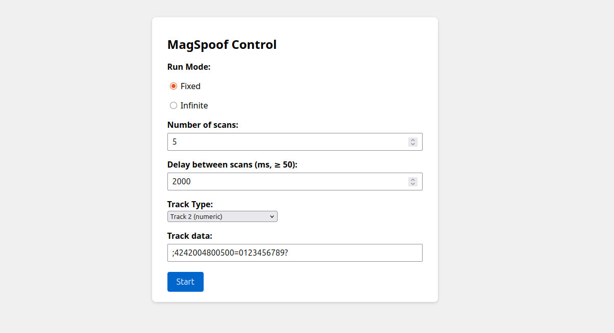
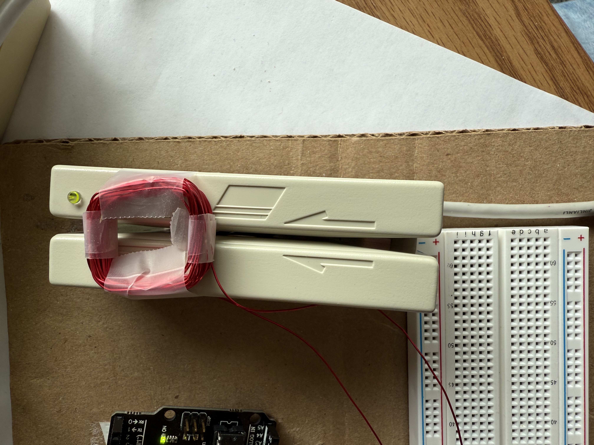
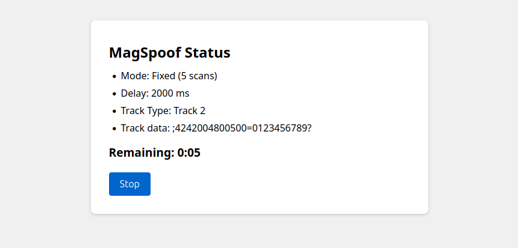

## Magstripe Spoofer

A web app that interacts with an Arduino-driven H-bridge to emulate magnetic stripe card swipes of any kind. It is ideal for testing, prototyping, and automating card reader systems without needing physical cards.

## Table of Contents

1. [Magstripe Spoofer](#magstripe-spoofer)  
2. [Required Hardware](#required-hardware)  
3. [Hardware Setup](#hardware-setup)  
   1. [Pin Configuration Table](#pin-configuration-table)  
   2. [Winding the Coil](#winding-the-coil)  
4. [After Completion](#after-completion)  
5. [Software Setup](#software-setup)  
   1. [Prerequisites](#prerequisites)  
   2. [Arduino and Web Server](#arduino-and-web-server)  
   3. [Simulating Swipes](#simulating-swipes)  
   4. [Place the Coil onto the Magstripe Reader](#place-the-coil-onto-the-magstripe-reader)  
   5. [Running the Program](#running-the-program)  
6. [Code Overview](#code-overview)  
   1. [`setup.sh`](#setupsh)  
   2. [`magstripespoofer.ino`](#magstripespooferino)  
   3. [MagSpoof Class](#magspoof-class)  
   4. [`server/server.py`](#serverserverpy)  
   5. [`server/index.html`](#serverindexhtml)  
   6. [`server/status.html`](#serverstatushtml)  

## Required Hardware

- **Arduino Nano** – Microcontroller
- **L293D Motor Driver IC** – To power the magnetic field
- **24 AWG Magnet Wire** – To generate the magnetic field
- **Supporting Parts** – Breadboard, wires

---

## Hardware Setup
Assemble the circuit depicted below
> **Note:** *While the diagram shows VIN connected to pin 1 (EN1), I’ve found it more reliable to wire the Arduino’s 5 V to pin 1 as listed in the pin configuration table.*

  

### Pin Configuration Table

Wire each Nano pin to the corresponding pin (as shown on table):
> **Note:** *Setup derived from [MagSpoof by samyk](https://github.com/samyk/magspoof/)*

| L293D Pin | Nano Connection | Label | Purpose                                                |
| --------- | --------------- | ----- | ------------------------------------------------------ |
| 1         | 5 V             | EN1   | Enables H-bridge channel |
| 2         | D4              | IN1   | Direction control A (sets coil polarity) |
| 7         | D3              | IN2   | Direction control B (sets coil polarity) |
| 3         | Coil lead 1     | OUT1  | Output to first coil wire                              |
| 6         | Coil lead 2     | OUT2  | Output to second coil wire                             |
| 8         | D13             | VCC2  | Toggles coil power (allows web server to start/stop)   |
| 5         | GND             | GND   | Ground  |


### Winding the Coil
- We used 24 AWG Magnet Wire, wrapped around a 1 square inch area 50 times
- You can experiment with different gauges and coil dimensions

---

### After Completion:

  

---

## Software Setup

### Prerequisites
- **Python 3.8+**
- **pip**
- A POSIX-style shell

### Arduino and Web Server
1. Clone the repository
   ```bash
   git clone https://github.com/DuncBoi/MagstripeSpoofer.git
   cd MagstripeSpoofer
   ```

2. Create a virtual environment  
   ```bash
   python3 -m venv venv
   ```

3. Activate the virtual environment (choose the command that matches your shell)  
   **bash / zsh / sh**  
   ```bash
   source venv/bin/activate
   ```  
   **csh / tcsh**  
   ```csh
   source venv/bin/activate.csh
   ```  
   **fish**  
   ```fish
   source venv/bin/activate.fish
   ```
   
4. Install Python dependencies
   ```bash
   pip install --upgrade pip
   pip install -r requirements.txt
   ```
   Upgrades `pip` and installs libraries from `requirements.txt`.

5. Run the setup script
   ```bash
   chmod +x setup.sh
   ./setup.sh
   ```
   Compiles the Arduino sketch via `arduino-cli` and uploads it to the Nano on the configured serial port.
  
6. Start the web server
   ```bash
   cd server
   python3 server.py
   ```
   It should print out something like:
   ```bash
   ENGINE Serving on http://10.15.57.104:8080
    ```
   Now you can access the server from the provided address

---

## Simulating Swipes
This is what you should see when you load the web page:  
  

### Features
- You can choose to transmit a fixed or infinite amount (program runs until stop button is hit) of simulated swipes
- You can specify any delay (in ms) between simulated swipes
- You can choose between any of the three classic Magstipe track types to simulate
- You can use the default track data or input your own

### Place the Coil onto the Magstripe Reader
> **Note:** *Finding the correct angle and placement of the coil so that it reliably triggers the barcode reader can be tedious. I find that it works best when placed above the ends of the reader and away from the center. Once you find a good location, tape the coil to the spot for repeated use*

Example:
  

### Running the Program
- Just click the start button and the UI will display any errors in communicating with the arduino
- If everything goes well, you will see something like this:

  

- To stop the program, just hit the stop button and the arduino will reset

## Code Overview

Below is a summary of each major code component and its purpose:

### `setup.sh`
- **Group & Permissions**  
  Checks/adds your user to `dialout` so you can access `/dev/ttyACM0`.  
- **arduino-cli Installation**  
  Installs or updates `arduino-cli`, then updates and installs the AVR core.  
- **Build & Flash**  
  Compiles the sketch for `arduino:avr:uno` and uploads it to the Nano on the specified serial port.

### `magstripespoofer.ino`
- **MagSpoof Setup**  
  Initializes the MagSpoof library with your pin mappings (A, B, ENABLE) and track format.  
- **`setup()`**  
  - Brings up the MagSpoof hardware.  
  - Opens serial at 9600 baud.  
  - Reads three lines from the PC:  
    1. `INF` or swipe count  
    2. Delay in milliseconds  
    3. The raw track data string  
- **`loop()`**  
  - If infinite mode: loops `playTrack(trackBuffer)` with delay, listens for a `STOP` command.  
  - If fixed count: calls `playTrack(trackBuffer)` exactly `scanCount` times, or until `STOP`.  
  - After finishing, halts in a 1 s delay loop to prevent accidental replays.

### MagSpoof Class

- **Initialization & Setup**  
  Configures drive pins (`pinA`, `pinB`, `pinEnable`), timing (`clockUS`), bits-per-character, and parity in the constructor, then sets them as outputs in `setup()`.  
- **Bit & Track Playback**  
  `playBit()` toggles coil polarity and pulses for one or two half-cycles; `playTrack()` sends leading zeros, encodes each character (with optional parity), computes/transmits LRC, then trailing zeros.  
- **Character Conversion**  
  `convertChar()` maps ASCII characters into numeric values based on the selected bits-per-character format (BPC4–BPC7).

### server/server.py

- **Web Interface (CherryPy)**  
  Defines `/` (serves `index.html`), `/run` (validates inputs, writes count/delay/track over serial, redirects to status), and `/stop` (sends a “stop” command to the Arduino).  
- **Serial Communication**  
  Opens `/dev/ttyACM0` at 9600 baud, waits for `READY`, then sends three newline-terminated lines (`count`, `delay`, `track`) or a stop sequence.  
- **Network & Static Files**  
  Detects host IP via `netifaces`, configures CherryPy socket, and serves `status.html` statically under `/status`.

### server/index.html and server/status.html
- **Basic UI Components**  
  all html, css, and js


