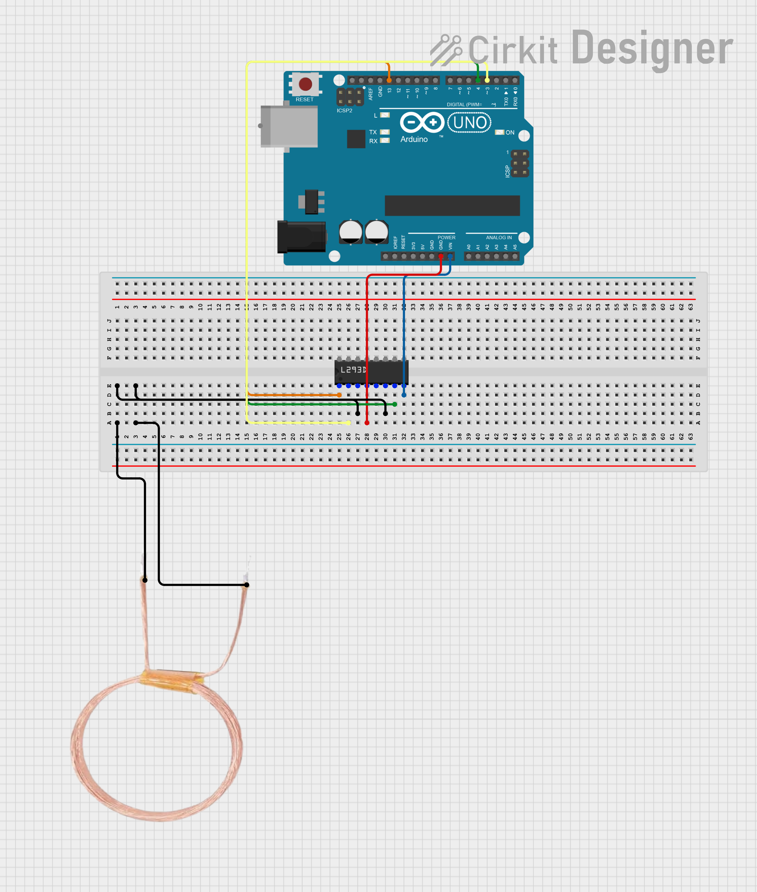
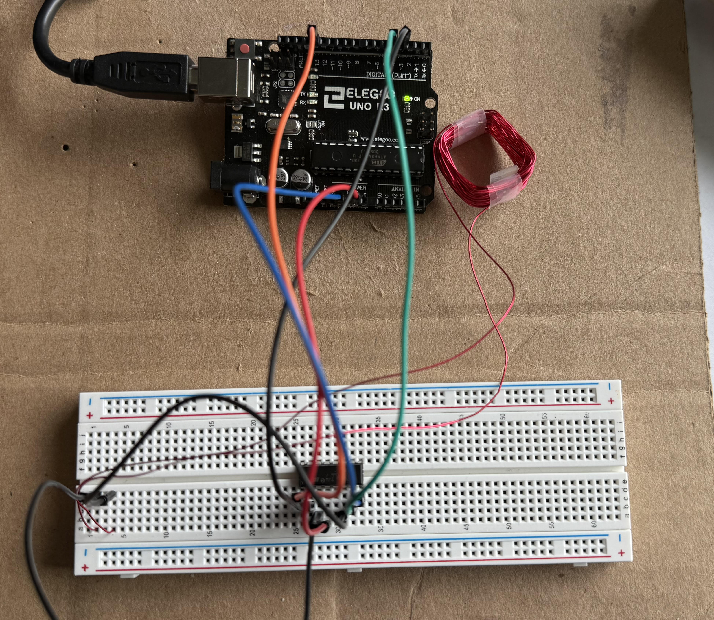

## Required Hardware

- **Arduino Nano** – Microcontroller
- **L293D Motor Driver IC** – To power the magnetic field
- **24 AWG Magnet Wire** – To generate the magnetic field
- **Supporting Parts** – Breadboard, wires

---

## Hardware Setup
Assemble the circuit depicted below
> **Note:** *While the diagram shows VIN connected to pin 1 (EN1), I’ve found it more reliable to wire the Arduino’s 5 V to pin 1 as listed in the pin configuration table.*

  

### Pin Configuration Table

Wire each Nano pin to the corresponding pin (as shown on table):
> **Note:** *Setup derived from [MagSpoof by samyk](https://github.com/samyk/magspoof/)*

| L293D Pin | Nano Connection | Label | Purpose                                                |
| --------- | --------------- | ----- | ------------------------------------------------------ |
| 1         | 5 V             | EN1   | Enables H-bridge channel |
| 2         | D4              | IN1   | Direction control A (sets coil polarity) |
| 7         | D3              | IN2   | Direction control B (sets coil polarity) |
| 3         | Coil lead 1     | OUT1  | Output to first coil wire                              |
| 6         | Coil lead 2     | OUT2  | Output to second coil wire                             |
| 8         | D13             | VCC2  | Toggles coil power (allows web server to start/stop)   |
| 5         | GND             | GND   | Ground  |

> **Note:** *Hardware setup derived from [MagSpoof by samyk](https://github.com/samyk/magspoof/)*

### Winding the Coil
- We used 24 AWG Magnet Wire, wrapped around a 1 square inch area 50 times
- You can experiment with different gauges and coil dimensions

---

### After Completion:

  

---

## Software Setup

### Prerequisites
- **Python 3.8+**
- **pip**
- A POSIX-style shell

### Arduino and Web Server
1. Clone the repository
   ```bash
   git clone https://github.com/DuncBoi/MagstripeSpoofer.git
   cd MagstripeSpoofer
   ```

2. Create a virtual environment  
   ```bash
   python3 -m venv venv
   ```

3. Activate the virtual environment (choose the command that matches your shell)  
   **bash / zsh / sh**  
   ```bash
   source venv/bin/activate
   ```  
   **csh / tcsh**  
   ```csh
   source venv/bin/activate.csh
   ```  
   **fish**  
   ```fish
   source venv/bin/activate.fish
   ```
   
4. Install Python dependencies
   ```bash
   pip install --upgrade pip
   pip install -r requirements.txt
   ```
   Upgrades `pip` and installs libraries from `requirements.txt`.

5. Run the setup script
   ```bash
   chmod +x setup.sh
   ./setup.sh
   ```
   Compiles the Arduino sketch via `arduino-cli` and uploads it to the Nano on the configured serial port.
  
6. Start the web server
   ```bash
   cd server
   python3 server.py
   ```
   It should print out something like:
   ```bash
   ENGINE Serving on http://10.15.57.104:8080
    ```
   Now you can access the server from the provided address  
